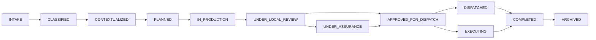
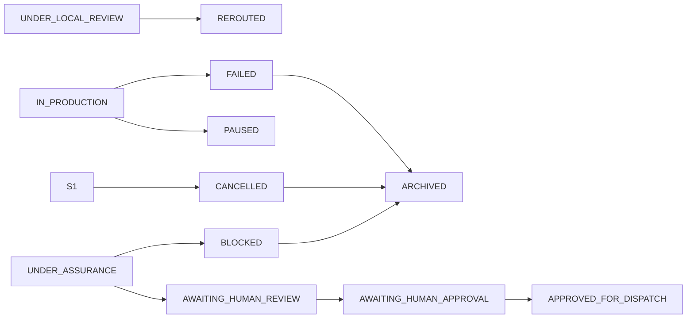

# {sovereign} - Workflow State Machine Specification (Normalized)

**Status:** Foundational Normative Specification  
**Version:** v1.0  
**Date:** 2026-03-27  
**Scope:** Canonical workflow lifecycle, guarded transitions, intervention semantics, and terminal conditions for `{sovereign}`

---

## 1. Purpose

This document defines the workflow lifecycle of `{sovereign}`.

It answers the system question:

> **How does governed work move through `{sovereign}` in a controlled, observable, interruptible way?**

---

## 2. Reader Orientation

A workflow in `{sovereign}` is not a stream of prompts.  
It is a governed stateful object.

This document specifies the legal states and legal transitions of that object.

---

## 3. Core Thesis

A workflow MAY generate provisionally, but it SHALL progress consequentially only through visible, guarded, auditable states.

---

## 4. Normative Language

- **SHALL / SHALL NOT** → mandatory requirement
- **SHOULD / SHOULD NOT** → strong default
- **MAY** → permitted option

---

## 5. Canonical Terminology Reference

This document defers to:
- `sovereign_canonical_vocabulary_v1.md`
- `sovereign_constitutional_invariants_v1.md`

---

## 6. Canonical State Set

| Code | State | Meaning |
| --- | --- | --- |
| S0 | `INTAKE` | request exists but is not yet normalized |
| S1 | `CLASSIFIED` | task type and initial risk assigned |
| S2 | `CONTEXTUALIZED` | context, memory, and relevant signals attached |
| S3 | `PLANNED` | route and task graph accepted by `{zeno}` |
| S4 | `IN_PRODUCTION` | output is being produced or refined |
| S5 | `UNDER_LOCAL_REVIEW` | local adjudication in progress |
| S6 | `UNDER_ASSURANCE` | independent assurance in progress |
| S7 | `AWAITING_HUMAN_REVIEW` | human inspection required |
| S8 | `AWAITING_HUMAN_APPROVAL` | explicit authorization required |
| S9 | `APPROVED_FOR_DISPATCH` | approved for external consequence routing |
| S10 | `DISPATCHED` | communication consequence occurred |
| S11 | `EXECUTING` | execution consequence underway |
| S12 | `COMPLETED` | workflow ended successfully |
| S13 | `PAUSED` | intentionally suspended |
| S14 | `REROUTED` | transferred to another path |
| S15 | `BLOCKED` | cannot proceed safely or legally |
| S16 | `FAILED` | ended unsuccessfully after valid attempts or unrecoverable failure |
| S17 | `CANCELLED` | intentionally terminated |
| S18 | `ARCHIVED` | final retained state |

---

## 7. Lifecycle Reading

The lifecycle has four broad phases:

1. **Formation**  
   `INTAKE` → `CLASSIFIED` → `CONTEXTUALIZED`

2. **Control and production**  
   `PLANNED` → `IN_PRODUCTION` → `UNDER_LOCAL_REVIEW`

3. **Validation and consequence routing**  
   `UNDER_LOCAL_REVIEW` and/or `UNDER_ASSURANCE` → human review/approval states when needed → `APPROVED_FOR_DISPATCH`

4. **Action and closure**  
   `DISPATCHED` and/or `EXECUTING` → `COMPLETED` → `ARCHIVED`

`APPROVED_FOR_DISPATCH` means approval for consequence routing, not message-only sending.

---

## 8. Primary Forward Path

---

## 9. Interruption and Escalation Path

---

## 10. State Ownership and Meaning

- `{meimei}` MAY own intake normalization before authoritative workflow opening
- `{zeno}` SHALL own the authoritative workflow state
- `{trinity}` MAY own local production and local review artifacts
- `{tribeca}` SHALL own assurance states
- humans MAY own review or approval states
- `{reply}` owns governed communication consequence
- `{playground}` owns governed execution consequence

There SHALL be exactly one authoritative workflow state at a time.

---

## 11. Key Transition Rules

### 11.1 Legal examples
- `INTAKE` → `CLASSIFIED`
- `CLASSIFIED` → `CONTEXTUALIZED`
- `PLANNED` → `IN_PRODUCTION`
- `UNDER_LOCAL_REVIEW` → `IN_PRODUCTION`
- `UNDER_LOCAL_REVIEW` → `UNDER_ASSURANCE`
- `UNDER_LOCAL_REVIEW` → `APPROVED_FOR_DISPATCH` only when risk policy permits local completion
- `UNDER_ASSURANCE` → `APPROVED_FOR_DISPATCH`
- `UNDER_ASSURANCE` → `AWAITING_HUMAN_REVIEW`
- `AWAITING_HUMAN_APPROVAL` → `APPROVED_FOR_DISPATCH`
- `APPROVED_FOR_DISPATCH` → `DISPATCHED`
- `APPROVED_FOR_DISPATCH` → `EXECUTING`
- `COMPLETED` → `ARCHIVED`

### 11.2 Forbidden examples
- `INTAKE` → `IN_PRODUCTION`
- `CLASSIFIED` → `APPROVED_FOR_DISPATCH`
- `IN_PRODUCTION` → `COMPLETED`
- `UNDER_LOCAL_REVIEW` → `DISPATCHED`
- `UNDER_LOCAL_REVIEW` → `EXECUTING`
- `UNDER_ASSURANCE` → `COMPLETED`
- `BLOCKED` → `DISPATCHED`
- `FAILED` → `EXECUTING`
- `ARCHIVED` → active state

---

## 12. Guard Conditions

A transition SHALL occur only if its guard conditions are satisfied.

Representative guards:
- `INTAKE` → `CLASSIFIED`: intent normalized, task type known
- `CLASSIFIED` → `CONTEXTUALIZED`: initial risk assigned, progression allowed
- `CONTEXTUALIZED` → `PLANNED`: context pack sufficient
- `PLANNED` → `IN_PRODUCTION`: route accepted, producer selected
- `UNDER_LOCAL_REVIEW` → `UNDER_ASSURANCE`: provisional output and local evaluation available
- `UNDER_ASSURANCE` → `APPROVED_FOR_DISPATCH`: class-appropriate assurance passed
- `AWAITING_HUMAN_APPROVAL` → `APPROVED_FOR_DISPATCH`: explicit approval recorded
- `APPROVED_FOR_DISPATCH` → `DISPATCHED` or `EXECUTING`: consequence path valid

A high scalar score SHALL NOT bypass missing guards.

---

## 13. Risk-Class Effects on Progression

| Risk class | Minimum required progression |
| --- | --- |
| R0 | local review path MAY be sufficient before consequence routing or closure |
| R1 | local review + traceability |
| R2 | mandatory assurance before consequential release or execution |
| R3 | R2 path + usually human review |
| R4 | R3 path + mandatory human approval before finalization |

No workflow MAY enter `APPROVED_FOR_DISPATCH` if its required stronger boundary remains unmet.

---

## 14. Interventions

Canonical interventions:
- `pause`
- `resume`
- `retry`
- `reroute`
- `escalate`
- `block`
- `cancel`

Every non-terminal active state SHOULD support at least one meaningful intervention path.

---

## 15. Branching and Subworkflows

`{sovereign}` is graph-based, not purely linear.

Rules:
- branches SHOULD have branch identifiers
- subworkflows SHALL preserve parent linkage
- merged outputs SHALL preserve source lineage
- merged outputs SHALL inherit the strictest applicable risk posture where shared consequence exists

---

## 16. Failure, Block, and Cancel Semantics

- `FAILED` = unsuccessful end after valid attempts or unrecoverable failure
- `BLOCKED` = cannot proceed safely or legally yet
- `CANCELLED` = intentionally terminated

These SHALL remain distinct for audit, learning, and blame-assignment reasons.

---

## 17. Memory and Metabolic Effects

- provisional states SHOULD write only working or episodic memory
- completed workflows MAY produce system-learning memory
- blocked or failed workflows SHOULD generate diagnostic artifacts such as `RootCauseTicket`
- state transitions SHOULD record time, owner, and metabolic cost data

---

## 18. Worked Examples

### 18.1 R1 internal summary
Path:
`INTAKE` → `CLASSIFIED` → `CONTEXTUALIZED` → `PLANNED` → `IN_PRODUCTION` → `UNDER_LOCAL_REVIEW` → local completion route → `COMPLETED` → `ARCHIVED`

### 18.2 R2 external email draft
Path:
`INTAKE` → `CLASSIFIED` → `CONTEXTUALIZED` → `PLANNED` → `IN_PRODUCTION` → `UNDER_LOCAL_REVIEW` → `UNDER_ASSURANCE` → `APPROVED_FOR_DISPATCH` → `DISPATCHED` → `COMPLETED` → `ARCHIVED`

### 18.3 R4 healthcare-sensitive recommendation
Path:
`INTAKE` → `CLASSIFIED` → `CONTEXTUALIZED` → `PLANNED` → production / review states → `UNDER_ASSURANCE` → `AWAITING_HUMAN_REVIEW` → `AWAITING_HUMAN_APPROVAL` → `APPROVED_FOR_DISPATCH` → governed consequence path → `COMPLETED` → `ARCHIVED`

---

## 19. Integration With Other Specs

- **Risk policy** determines which review and approval states are mandatory.
- **Interface contract** determines how state, risk, and transition metadata are serialized.
- **Score/calibration** supplies local evaluation signals but SHALL NOT override guards.
- **Vocabulary** and **invariants** remain authoritative for shared terms and non-negotiables.

---

## 20. Conclusion

A workflow in `{sovereign}` is a governed stateful object.

It MAY generate provisionally.  
It SHALL progress consequentially only through visible, guarded, auditable states.
